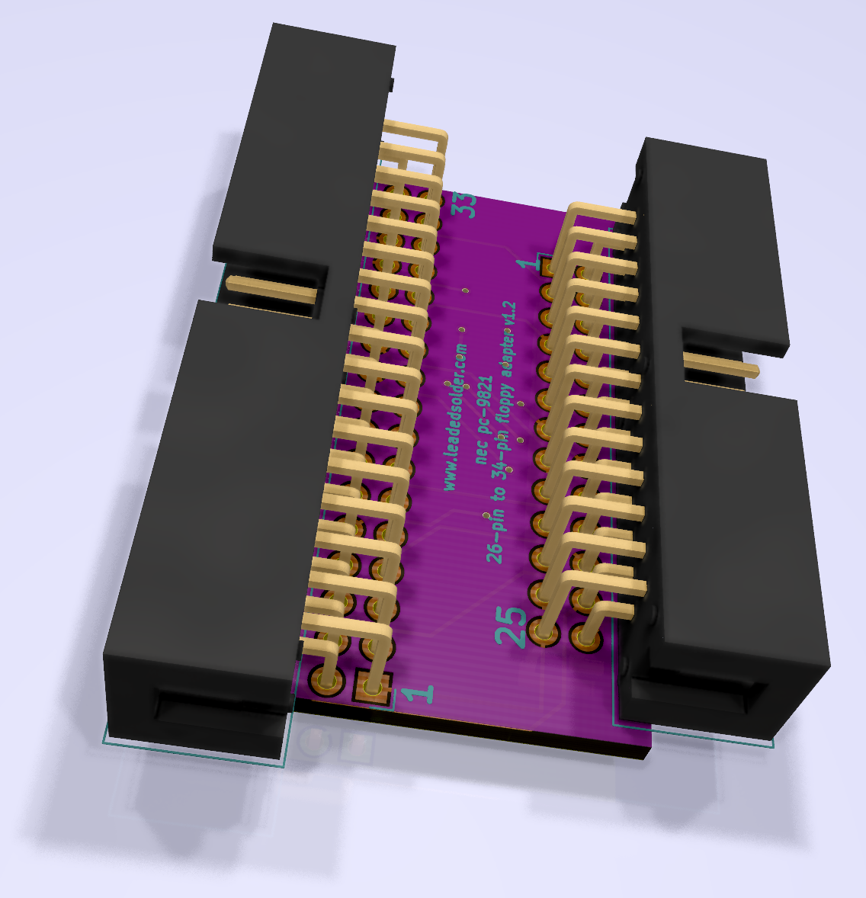

# PC9821 26-pin to 34-pin floppy drive adapter
Some models of NEC PC9821 have a 26-pin "laptop style" floppy connection instead of a 34-pin IBM PC style connector for their 3.5" floppy drives.

This adapter converts the internal 26-pin bus of the PC9821 to support a 34-pin IBM PC style drive such as the Gotek.

## Links
 * [Schematic](3426CONV.PDF)
