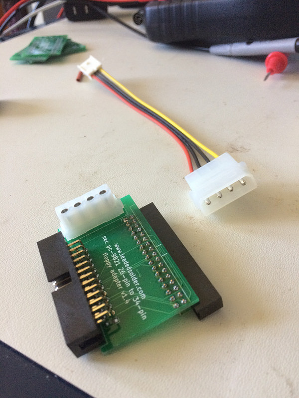
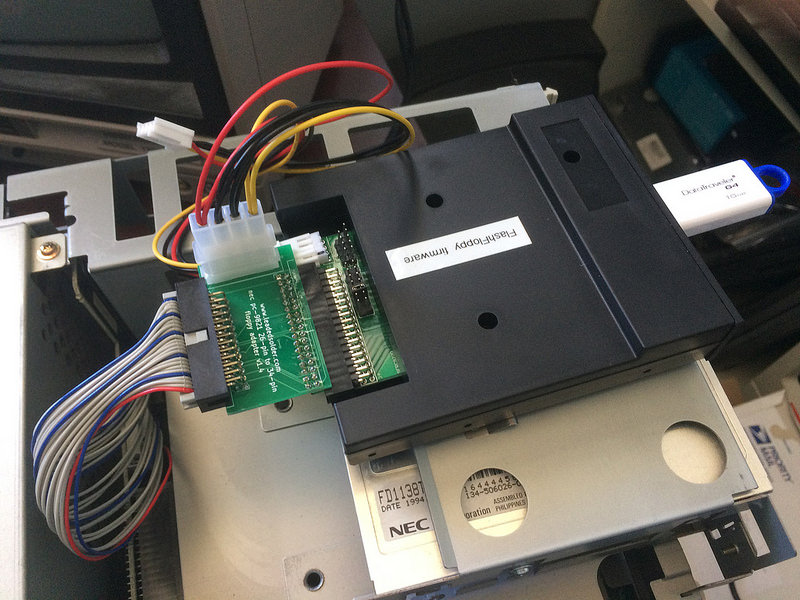

# PC9821 26-pin to 34-pin floppy drive adapter
Some models of NEC PC9821 have a 26-pin "laptop style" floppy connection instead of a 34-pin IBM PC style connector for their 3.5" floppy drives.

This adapter converts the internal 26-pin bus of those PC9821 models to support a 34-pin IBM PC style drive such as the Gotek.

Note that this is only intended to work on the NEC FD1138T floppy drives; reportedly, the 1138H needs a "VFO board" in order to work.

If you have an NEC _1148T_ floppy drive, you already have a 34-pin floppy connector, and can just use the Gotek in Shugart mode.

## Supported Hardware
Confirmed working in:
 * PC9821AP2/U8W

## Bill of Materials
 * TE AMP 770997-1 "Molex" style female connector [770997-1-ND](https://www.digikey.ca/product-detail/en/te-connectivity-amp-connectors/770997-1/770997-1-ND/240923)
 * 0.100" 26-pin right-angle male IDC header [1175-1619-ND](https://www.digikey.ca/product-detail/en/cnc-tech/3020-26-0200-00/1175-1619-ND/3441749)
 * 0.100" 34-pin right-angle female IDC header [S9207-ND](https://www.digikey.ca/product-detail/en/sullins-connector-solutions/SFH11-PBPC-D17-RA-BK/S9207-ND/1990100)

## Links
 * [Schematic](3426CONV.pdf) from [cpuparts98](http://www.geocities.jp/cpuparts98/FDD/FDDCABLE/2634CONV.htm)
 * [Another conversion board](http://triss.blog93.fc2.com/blog-entry-92.html)
 * [Conversion details](https://github.com/keirf/FlashFloppy/wiki/Host-Platforms#nec-pc-98) from the FlashFloppy wiki
